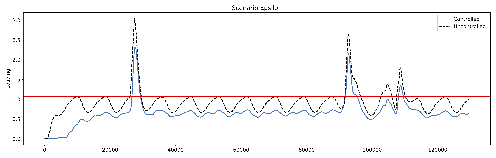

# Bayesian Optimization - Scenario Epsilon Evaluation 

A constant gate position in the network is able to reduce the overall loading to the wwtp. It might be more efficient in handling daily flows than spikes. Which would make sense, as we are changing the "capacitance" of the system. Might be interesting to see if the Bayopt is able to figure out a better solution.

## 45 Samples

I am honestly impressed with the response after 45 samples, it is able to achieve a performance improvement of about 50\%

| Scenario     | Performance        |
| ------------ | -----------------  |
| Uncontrolled | 7721.27364541205   |
| Controlled   | 3480.9147118484902 |

### Contents 
1. `ckpts` : Bayesian-Opt checkpoints (eps=0.05) - Rand Seed 42
2. `ckpts2` : Bayesian-Opt checkpoints (eps=0.05) - Rand Seed 40
3. `ckpts3`: Bayesina-Opt checkpoitns (eps=0.05) - Rand Seed 30
